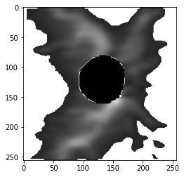
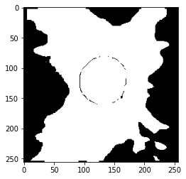

# EyeLearn

The dataset and code for the paper entitled [**Artifact-Tolerant Clustering-Guided Contrastive Embedding Learning for Ophthalmic Images**](https://ieeexplore.ieee.org/document/10159482) published in the IEEE Journal of Biomedical and Health Informatics.


## Requirements
Python 3.8 <br/>
tensorflow 2.4.0 <br/>
opencv-python 4.5.5

## Dataset
The dataset includes 500 OCT retinal nerve fiber layer thickness (RNFLT) maps (dimension 225 x 225) from 500 unique glaucoma patients. The glaucoma label and visual field mean deviation (MD) information are also included in the data. The dataset can be accessed via this [link](https://ophai.hms.harvard.edu/datasets/harvard-gd500/). This dataset can only be used for non-commercial research purposes. At no time, the dataset shall be used for clinical decisions or patient care. The data use license is [CC BY-NC-ND 4.0](https://creativecommons.org/licenses/by-nc-nd/4.0/).

Here are sample codes to visualize the RNFLT map:
````
from utils.map_handler import *
import matplotlib.pyplot as plt

rnflts = np.load('dataset/rnflt_map.npy')
img = rnflts[0]
plot_2dmap(img, show_cup=True)
````


Calculate the masked RNFLT and corresponding mask image:
````
masked_map, ori_mask, resized_map = process(img, cutoff=50) #RNTLT values less than the cutoff are treated as artifacts
plt.imshow(masked_map)
plt.show()
plt.imshow(ori_mask)
````



## Pretrained Model
The model weight "EyeLearn_weights.72-0.0019.h5" trained using 10,000 samples from our larger private dataset can be downloaded via this [link](https://ophai.hms.harvard.edu/datasets/harvard-gd500/)


## Use the Model
````
from models import rnflt2vec

# load the pretrained model
eyelearn = rnflt2vec.construct_model_from_args(args)
model.load('EyeLearn_weights.72-0.0019.h5', train_bn=False, lr=0.00005)

# embedding learning model
encoder = eyelearn.model.get_layer('embed_model')
model_embed = Model(inputs=encoder.inputs, 
                    outputs=encoder.get_layer('encoder_output').output)
                    
# artifact correction model                   
model_correction = Model(inputs=[eyelearn.model.inputs[0], eyelearn.model.inputs[1]],
                                 outputs=eyelearn.model.output[0])
                                 
# embedding inference
embeds = model_embed.predict([masked_map, ori_mask])[0] 
# artifact correction
preds = model_correction.predict([masked_map, ori_mask])[0]
````

#### Artifact correction examples: <br />


## Acknowledgement & Citation


If you find this repository useful for your research, please consider citing our [paper](https://ieeexplore.ieee.org/abstract/document/10159482):

```bibtex
@article{shi2023artifact,
  title={Artifact-Tolerant Clustering-Guided Contrastive Embedding Learning for Ophthalmic Images in Glaucoma},
  author={Shi, Min and Lokhande, Anagha and Fazli, Mojtaba S and Sharma, Vishal and Tian, Yu and Luo, Yan and Pasquale, Louis R and Elze, Tobias and Boland, Michael V and Zebardast, Nazlee and others},
  journal={IEEE Journal of Biomedical and Health Informatics},
  year={2023},
  publisher={IEEE}
}

